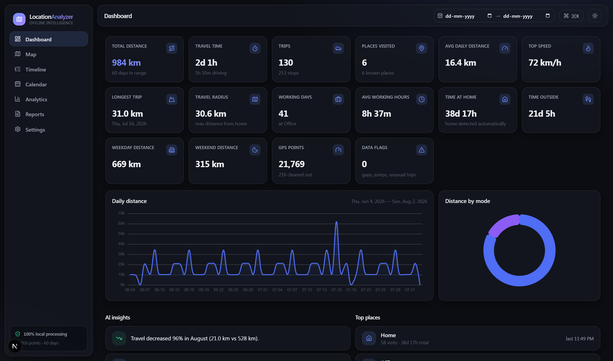
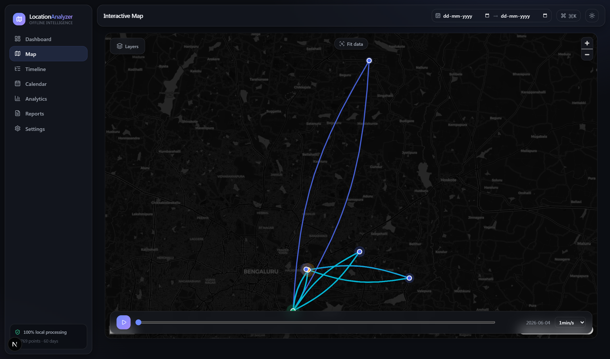
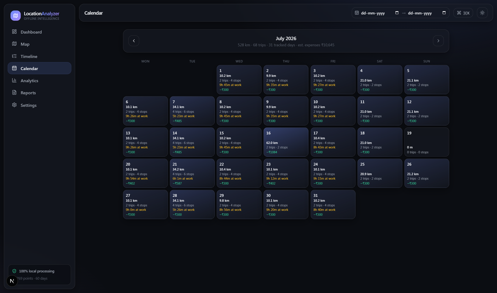
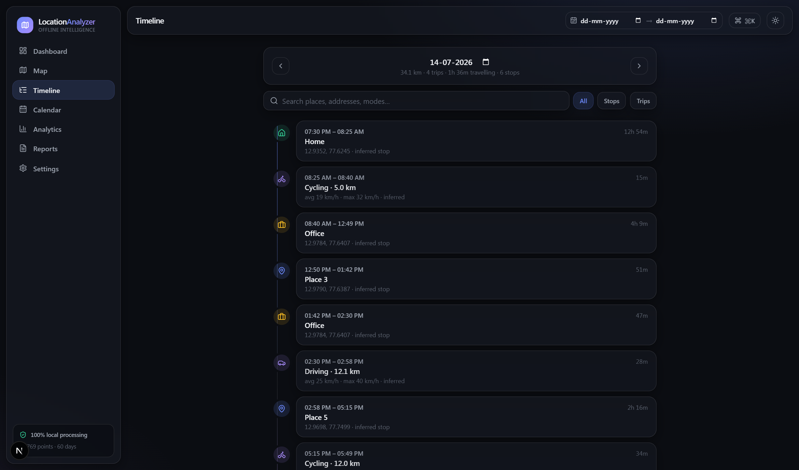
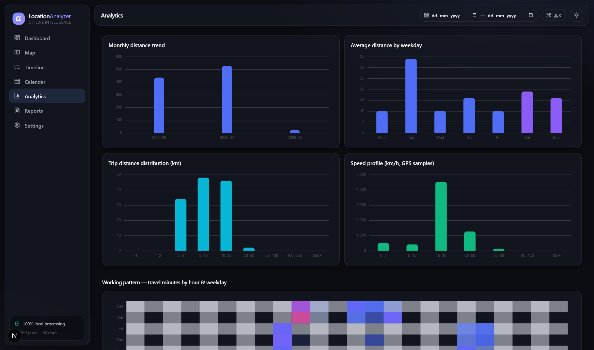

# 📍 Location Analyzer

**Offline-first location intelligence for Google Maps Timeline / Google Takeout data.**

Turn raw Google Location History into interactive, audit-ready insight — travel audit, employee-attendance verification, expense validation, movement analysis, route reconstruction, forensic timeline analysis and executive reporting — with a premium SaaS-grade UI that runs **entirely on your machine**.

> **Privacy by architecture, not by promise.** There is no backend, no cloud, no telemetry and no account. Parsing, analytics, storage and report generation all happen inside your browser. The only optional network traffic is anonymous basemap tiles, and even that can be switched off for a fully air-gapped mode.



| Route reconstruction & replay | Travel calendar & expenses |
|:---:|:---:|
|  |  |
| **Forensic timeline** | **Analytics & anomaly audit** |
|  |  |

*All screenshots were generated from the bundled synthetic sample dataset (`npm run sample`) — no real location data.*

---

## Table of contents

- [Feature overview](#feature-overview)
- [Supported input formats](#supported-input-formats)
- [Quick start](#quick-start)
- [Getting your Google data](#getting-your-google-data)
- [The views](#the-views)
- [Processing engine](#processing-engine)
- [Reports & exports](#reports--exports)
- [Performance](#performance)
- [Privacy model](#privacy-model)
- [Tech stack](#tech-stack)
- [Project structure](#project-structure)
- [Development](#development)
- [Deployment](#deployment)
- [Documentation](#documentation)
- [Limitations & honesty notes](#limitations--honesty-notes)

---

## Feature overview

| Area | Highlights |
|---|---|
| **Import** | Drag & drop Takeout `.zip` directly; every Google export format auto-detected; multi-GB files streamed without loading into memory |
| **Engine** | De-duplication, GPS-drift & jump removal, impossible-speed detection, stop/trip inference, transport-mode detection, place clustering, automatic home & office detection |
| **Dashboard** | 16 animated, clickable KPI cards; daily-distance trend; distance-by-mode donut; rule-based natural-language insights; top places |
| **Map** | Route reconstruction colored by mode, direction arrows, GPS point cloud with per-point inspection, density heatmap, place markers, light/dark/satellite/offline basemaps, **route replay** with variable speed & time scrubber |
| **Timeline** | Forensic day view — `Home ↓ Travel ↓ Office ↓ Lunch ↓ …` — with search, stop/trip filters and jump-to-map |
| **Calendar** | Month grid heat-tinted by travel volume; distance, trips, working hours and estimated expenses per day |
| **Analytics** | Monthly/weekday trends, trip-distance histogram, speed profile, hour×weekday working-pattern heatmap, travel calendar heatmap, data-quality & suspicious-movement audit |
| **Reports** | Printable audit report (PDF via browser print), multi-sheet Excel workbook, CSV exports, expense estimation, attendance summary, sign-off block |
| **UX** | Glassmorphism design system, dark/light themes, Framer Motion animations, command palette (`Ctrl/⌘ K`), skeleton loading, keyboard access, responsive layout |

## Supported input formats

| Format | File | Notes |
|---|---|---|
| Google Takeout archive | `takeout-*.zip` | streamed & unzipped in-browser; relevant entries auto-detected |
| Raw location records | `Records.json` | legacy `timestampMs` **and** modern ISO timestamps; multi-GB supported |
| Semantic Location History | `2023_JANUARY.json` … | `placeVisit` / `activitySegment` with place names & confidence |
| On-device Timeline export (2024+) | `Timeline.json` | `semanticSegments`, `timelinePath`, `rawSignals` (Android & iOS) |
| GPS tracks | `.gpx` | `trkpt`/`wpt`/`rtept` with time, elevation, speed |
| Google Earth / mobile KML | `.kml` | `gx:Track` (`<when>` + `<gx:coord>`) |
| Generic CSV | `.csv` | flexible headers: `lat/latitude(_e7)`, `lon/lng/longitude`, `time/timestamp`, optional speed/accuracy/altitude |

Multiple files can be dropped together (e.g. `Records.json` + a year of semantic files) — semantic data wins where it overlaps, inference fills the gaps.

## Quick start

```bash
npm install        # postinstall copies the MapLibre worker into /public
npm run dev        # → http://localhost:3000
```

Production build:

```bash
npm run build
npm start
```

### Try it with sample data (no Google export needed)

```bash
npm run sample     # generates sample-data/Records.json — 60 days of synthetic commuting
```

Then drag `sample-data/Records.json` onto the app: it will detect a home, an office, weekday commutes, Tuesday client visits, weekend outings and one airport day-trip.

## Getting your Google data

- **Google Takeout** — [takeout.google.com](https://takeout.google.com) → *Location History (Timeline)* → export → drop the `.zip` straight into the app.
- **2024+ on-device timeline** — Google moved Timeline storage onto the phone:
  - **Android**: Settings → Location → Location Services → Timeline → *Export Timeline data*
  - **iOS (Google Maps app)**: Profile → Your Timeline → ⋯ → *Export Timeline data*

  Drop the resulting `Timeline.json` into the app.

## The views

- **Dashboard** — headline KPIs (total distance, travel time, trips, places, cities-scale travel radius, working days, average working hours, home/outside time, weekday/weekend split, GPS quality, data flags). Every card navigates to the relevant deep-dive view.
- **Map** — the centerpiece. Layer toggles for routes / heatmap / GPS points / places; four basemap styles; click any GPS point for timestamp, speed, accuracy, elevation and distance-from-previous; click places for visit stats; replay any range with 10×–3600× time compression while the camera follows.
- **Timeline** — chronological forensic log per day with previous/next navigation, free-text search and inferred-vs-Google source labeling.
- **Calendar** — travel-volume heat tints, per-day distance/trips/working-hours/expenses, click-through to the day report.
- **Analytics** — trends and distributions plus a **data-quality audit**: tracking gaps ≥ 6 h, GPS jumps, sustained impossible speeds, night travel (23:00–04:00) and statistically unusual trips (vs the period's own baseline).
- **Reports** — a print-ready audit document and one-click exports (see below).
- **Settings** — expense rates & currency, basemap/privacy toggle, dataset management (inspect / wipe local cache).

## Processing engine

All of this runs in a **Web Worker**, keeping the UI at 60 fps:

1. **Streaming parse** — a character-level state machine extracts array elements from JSON of any size with memory bounded by a single element. ZIPs are decompressed as they stream.
2. **Cleaning** — chronological sort; duplicate & burst thinning (keeping ≥ 1 fix/min so dwell evidence survives); accuracy filter (> 250 m dropped); GPS-jump removal (a fix needing > 350 m/s to reach is dropped when the track provably "returns"); sustained impossible speeds kept but flagged.
3. **Segmentation** — stop detection via rolling-centroid clustering (≥ 7 min within 160 m ⇒ visit); movement between stops ⇒ trips with path distance, avg/max speed and mode (from Google's label when present, else speed heuristics).
4. **Semantic merge** — Google-reported visits/trips take precedence; inferred segments only fill uncovered gaps.
5. **Place intelligence** — greedy 150 m clustering; **home** = most overnight dwell (00–06 h); **office** = most weekday business-hours dwell (≥ 20 h total).
6. **Aggregation** — per-day stats with segments split at local midnight; behavioral anomaly flags; everything persisted to IndexedDB so the app reopens instantly.

## Reports & exports

- **PDF** — *Print / Save as PDF*: executive summary (natural-language), travel summary, attendance (working days, presence, leaves, late arrivals, early departures, commute stats), expense table, top locations, full daily log, sign-off section.
- **Excel** — sheets: `Summary`, `Daily Report`, `Trips`, `Stops`, `Visited Locations`, `Expenses` — styled headers, frozen panes.
- **CSV** — daily stats, timeline segments, or raw GPS points (ISO timestamps).
- **Expense calculator** — mileage (driving trips × rate/km), daily allowance (days > 5 km), parking heuristic (car arrival + ≥ 1 h dwell away from home). All rates and the currency symbol are configurable in Settings.

## Performance

- Columnar typed-array point store (`Float64Array`/`Float32Array`) — millions of GPS fixes in a few hundred MB, zero-copy transferred from the worker.
- Binary-search time-window lookups; trips reference point *index ranges*, never copies.
- Map rendering capped at ~120k points (stride-sampled) and ≤ 600 vertices per trip line.
- Tree-shaken ECharts modules; memoized derived analytics per `(dataset, date-range)`.

## Privacy model

| Question | Answer |
|---|---|
| Where is my data processed? | In your browser, in a Web Worker, on your machine |
| Where is it stored? | IndexedDB — processed dataset only; raw uploads are never persisted |
| What can leave the machine? | Nothing except optional anonymous basemap-tile requests (OpenStreetMap / CARTO / Esri) — disable in *Settings → Privacy* for air-gapped use |
| Telemetry, analytics, accounts? | None, none, none |

## Tech stack

**Next.js 15 · React 19 · TypeScript · Tailwind CSS v4 · Zustand · TanStack Query · Framer Motion · MapLibre GL · Apache ECharts · Dexie (IndexedDB) · fflate · ExcelJS · Vitest**

There is deliberately **no backend** — see [docs/ARCHITECTURE.md](docs/ARCHITECTURE.md) for why and how.

## Project structure

```
app/                    # Next.js routes: dashboard, map, timeline, calendar, analytics, reports, settings
components/
  shell/                # Sidebar, Topbar, CommandPalette, Providers
  map/MapView.tsx       # MapLibre integration + route-replay engine
  charts/EChart.tsx     # theme-aware ECharts wrapper
  ui/, upload/          # design-system primitives, drag & drop import
lib/
  parse/                # streaming JSON parser, Google/GPX/KML/CSV parsers, ZIP ingestion
  engine/               # clean → segment → places → stats pipeline; derive/insights/expense
  store/                # Zustand store + Dexie persistence
  workers/              # ingest worker entry point
  export/               # CSV & Excel builders
scripts/                # sample-data generator, MapLibre worker copier
tests/                  # Vitest unit tests (parsers & engine)
docs/                   # user guide, architecture, developer guide
```

## Development

```bash
npm test           # 15 unit tests over the streaming parser, format parsers and engine
npm run lint       # eslint
npm run sample -- 90 my-data   # optional args: days, output dir
```

See [docs/DEVELOPER.md](docs/DEVELOPER.md) for conventions, how to add a new import format or insight rule, known gotchas (MapLibre worker + CSS), and desktop packaging with **Tauri** or **Electron**.

## Deployment

**Docker**

```bash
docker build -t location-analyzer .
docker run -p 3000:3000 location-analyzer
```

**Static hosting / desktop shell** — the app is fully client-side; with `output: "export"` in `next.config.ts` it builds to plain static files servable from anywhere (or embeddable in a Tauri shell — instructions in the developer guide).

## Documentation

- [User guide](docs/USER_GUIDE.md) — importing, views, attendance logic, shortcuts
- [Architecture](docs/ARCHITECTURE.md) — data flow, algorithms, performance design
- [Developer guide](docs/DEVELOPER.md) — setup, conventions, packaging

## Limitations & honesty notes

- Distances, attendance, modes and expenses are **estimates** derived from GPS records and inference heuristics — device accuracy, tracking gaps and Google's own inference all affect them. Treat outputs as audit evidence to review, not ground truth.
- Reverse geocoding (street addresses for arbitrary coordinates) is not possible fully offline; place names come from Google's semantic data where available, otherwise coordinates are shown.
- Home/office detection needs a few weeks of data to be reliable; thresholds are documented and configurable in code.

---

*Built for auditors, forensic investigators, travel analysts, compliance teams — and anyone curious what their own timeline says.*
